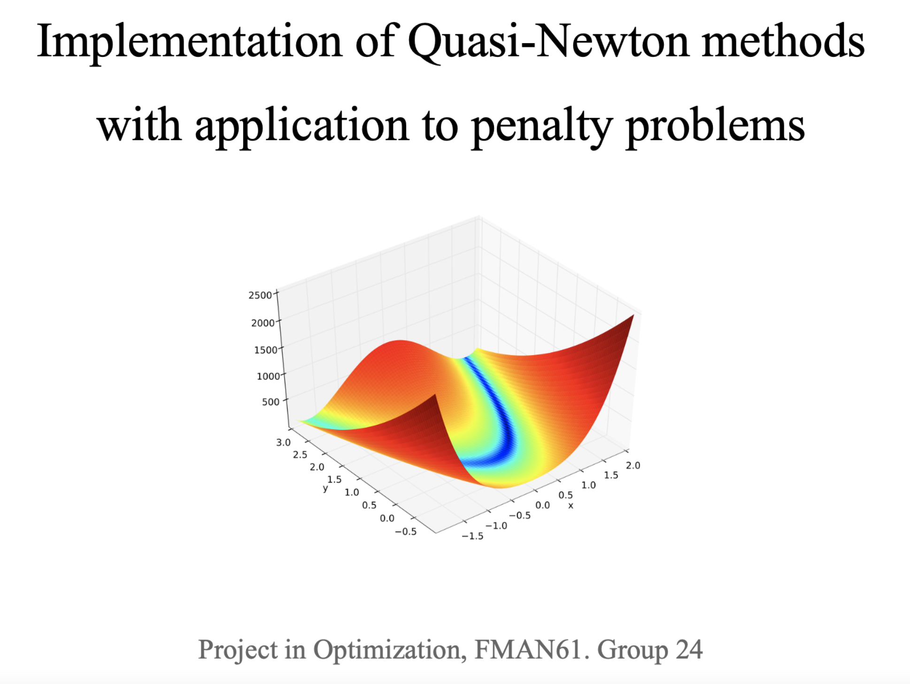
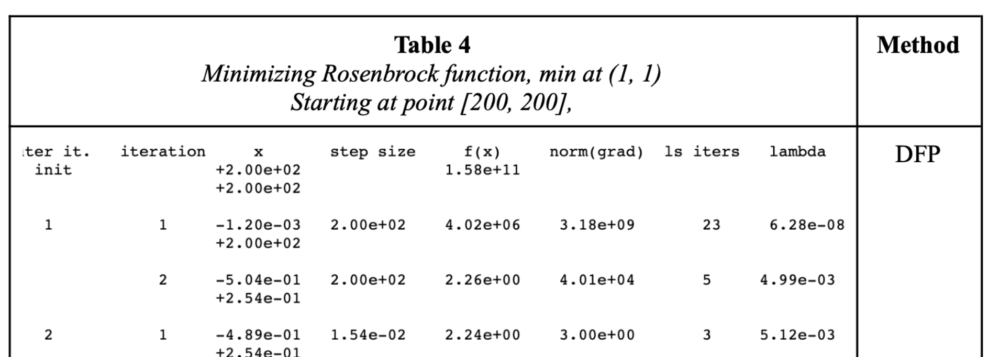
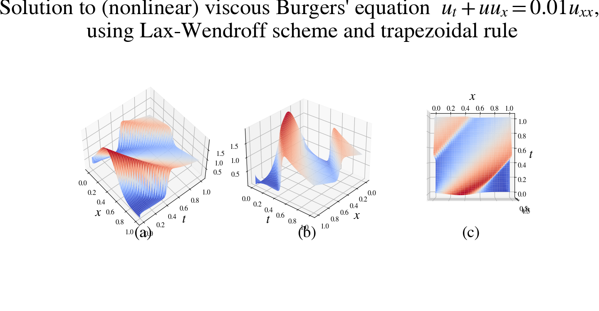
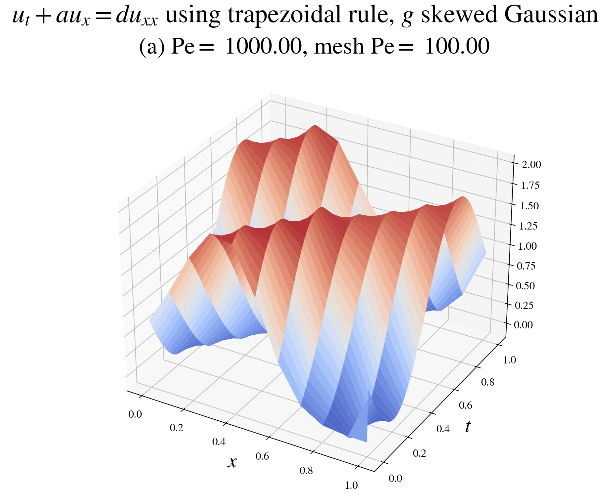

## Portfolio of Simon Danielsson

[LinkedIn profile](https://www.linkedin.com/in/simon-danielsson-527b7b215/)

The portfolio consists of projects in courses at ETH Zürich and the Faculty of Engineering at Lund University, as well as some private projects. Each course has been seperated into different directories.

In the following, a brief overview of some of the main material in the portfolio is presented. For more details I refer to the individual folders.  

### Summary 

#### Optimization 

- Implemented a multidimensional nonlinear optimizer using Quasi-Newton methods: specifically the DFP and BFGS methods. 'Exact' (Newton) line search was implemented. 
- Tests and thorough debugging facilities are implemented. Comprehensive report is available. 
- Implemented in Matlab.  

#### Machine Learning projects, private

- Evaluation of different classification models trained using the hyperparameter tuning library <code>Ray Tune</code> and the AutoML-service <code>auto-sklearn</code>, respectively. 
- Implemented in Python.   

#### Numerical Analysis

- Numerical methods of solving PDE's and boundary value problems. Different schemes (RK, Crank-Nicholson etc.) are used on a vast set of PDE's; among them are viscous Burger's equation, convection-diffusion equation, advection equations etc.  

#### Finite Element Method

#### Data Structures and Algorithms

