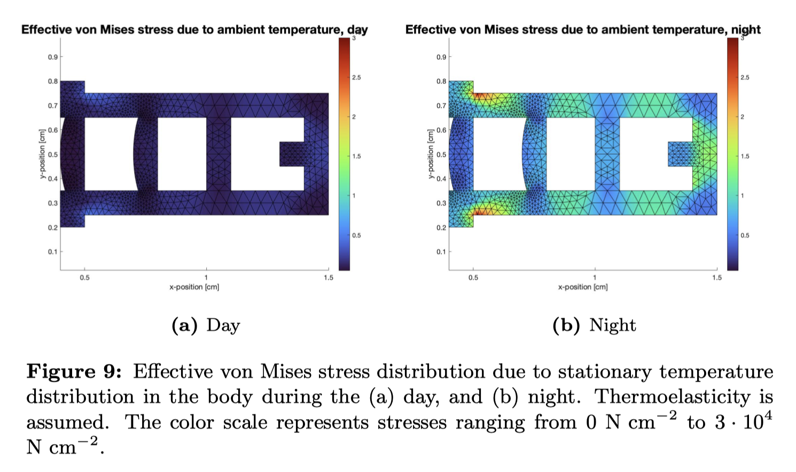

## Portfolio of Simon Danielsson

[LinkedIn profile](https://www.linkedin.com/in/simon-danielsson-527b7b215/)

The portfolio consists of projects in courses at ETH Zürich and the Faculty of Engineering at Lund University, as well as some private projects. The projects span the areas of pure mathematics (matrix theory), applied mathematics (optimization, ML, FEM) and pure programming (OOP design, data structures). 

The areas have been seperated into different directories.

In the following, a brief overview of some of the main material in the portfolio is presented. For more details I refer to the individual folders.  

### Summary 

#### Machine Learning projects, private

- Evaluation of different classification models trained using the hyperparameter tuning library <code>Ray Tune</code> and the AutoML-service <code>auto-sklearn</code>, respectively. 
- Implemented in Python.   

#### Optimization 

- Implemented a multidimensional nonlinear optimizer using Quasi-Newton methods: specifically the DFP and BFGS methods. 'Exact' (Newton) line search was implemented. 
- Tests and thorough debugging facilities are implemented. Comprehensive report is available. 
- Implemented in Matlab 

#### Matrix Theory

- Implementation of function which constructs the Jordan Normal form of an input matrix (with integral eigenvalues). 
- Implementet in Matlab.

#### Object-oriented Design

- Two projects in which design patterns are used throughout: 
	* Object-oriented model of computer architechture capable of running written programs, see first UML figure. 
	* Excel clone, with focus on implementation of MVC design pattern. Refer to UML diagram below.
- Implemented in Java

#### Finite Element Method

- Modeling and solving problems related to heat flow and thermoelastic solid mechanics in a NASA Mars rover, using the Finite Element Method.  
- Complete report available. 
- Implemented in Matlab

#### Numerical Analysis

- Numerical methods of solving PDE's and boundary value problems. Different schemes (RK, Crank-Nicholson etc.) are used on a vast set of PDE's; among them are viscous Burger's equation, convection-diffusion equation, advection equations etc.  
- Implemented in Python

#### Data Structures and Algorithms

- Exercies in data structures and algorithms (fairly standard course), in Java. 

