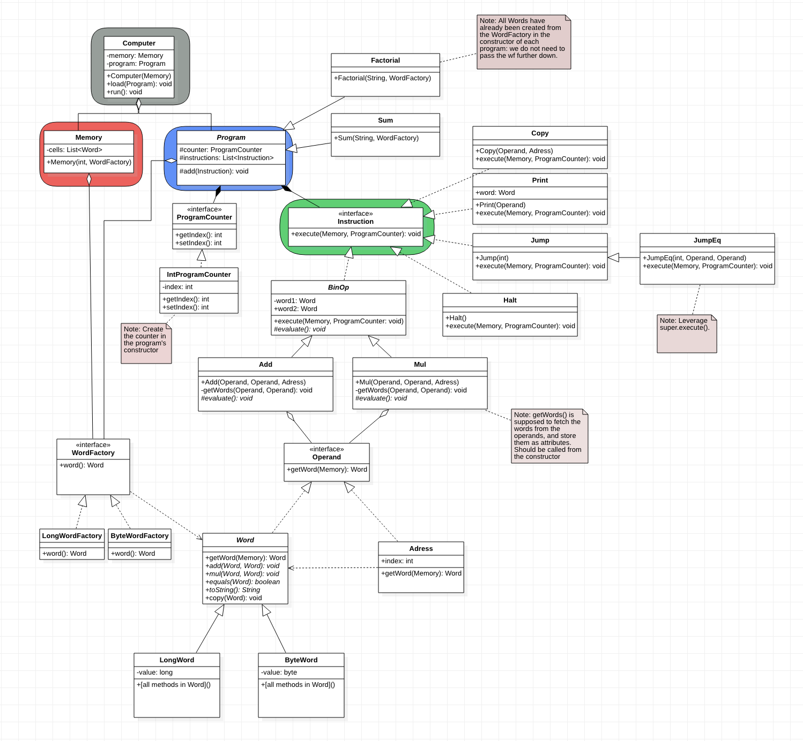

# Computer: Project 1 - EDAF60

## How to run:

Clone the repo, and <code>cd</code> into project folder <code>edaf60-project-sjif</code>. Once there, first enter

```console
$ ./gradlew build
```

and to run the main application, simply run

```console
$ ./gradlew run
```


## Recently asked questions (with answers)

**Q1:** How does the actual addition of two words take place. How does one extract the information (long, byte) inside the words such that they can be added and stored in the word which are operating with .add() on? Should we declare a get-method in Word (but what return type would it have)? 

A: It takes place where we have all the information we need
  for the actual type (as we did with our Point-examples
  during the first few lectures). We can safely(-ish)
  assume that we'll add, multiply, copy and compare with
  other Words of the same type (otherwise we might as well
  crash), but we don't need to return anything for add, mul
  and copy (see W5) -- everything will happen inside the
  words.

**Q2:** What exactly do we want computer.load(program) to do? 

To keep track of what program to run once we hit the
  run-method (see my comment about from where to run the
  program).
  
**Q3:** The instructions are already getting added to the list of instructions within program when the program's constructor is called. Is the reason that we want to use some kind of a Strategy pattern such that we can easily change program without creating a new computer?  

A: That's exactly right! This is an example of Strategy (I
  hadn't thought of it in those terms, but that is in fact
  what it is -- we will not use the ability to change
  programs, but we could have done so).


## Questions

**P1.** 

Our proposed project folder structure:

- Hardware (computer.hardware)
    - Computer
    - Memory
    - Word
        - ByteWord
        - LongWord
    - WordFactory
    - Adress
    - Program
    - Instruction (interface)
- Software (computer.software)
    - Instruction (classes)

and class diagram: 




**O1.**

An adress is a reference to a place in memory. It contains information on an index which points to a place in the computer's memory.   


**O2.** 

To fetch the information at the point in memory which the adress is poiting at, the adress need access to the memory. Thus, we have to pass the memory to the Adress-method getWord(Memory). We do this instead of storing a reference to the memory as an attribute in each Adress object.  

**O3.** 

(Adress, Word, Adress)

However, we would like to be able to pass any combination of Adresses/Words into the constructor of Add. We can do this by creating a superclass/interface <code>Operand</code> which both Word and Adress implements, and change the signature of the Add constructor to

Add  (Operand, Operand, Adress)

Note: The Operand interface should have public method

+ getWord(Memory).

When Adress implements this method, it should do what is said in **O2.**. In contrast, the Word's method getWord should just return itself (and not actually use the memory), i.e. return this. 


**O4.** 


Add is aggregated with Operand since it has to store objects implementing that interface (i.e. Adresses and Words) until the instruciton is executed.


**O5.** 

The Add-class should be able to get a word from the operand. It has to be able to store the operands as attributes (or store actual Words that are obtained from the operands, we can choose whatever). Add should then be able to perform operations on the Words, which means we have to declare a Word-interface with the methods that we want, see below.


**O6.** 

To get the value of an operand, it need a reference to the memory. 


**W1.** 

We need a <code>long</code> attribute in <code>LongWord</code>, and it should be declared in <code>LongWord</code>. 


**W2.** 

The actual addition of <code>LongWord</code> objects happen in <code>LongWord</code>. 


**W3.** 

The method that adds two words whould be declared in the Word interface. 

**W4.** 

We have a greater ability to modify each individual class implementing <code>Word</code> if we are not using Java's generics. 


**W5.** 

To declare such a method, we need the words to be mutable (i.e have a way to change the information which is contained in a word). Thus, we declare the add method in Word in the following way


add(Word w1, Word w2): void.

Thus, if we want to store the sum w1 + w2 at an adress n in memory, we first get the Word at the adress n, and use .add(w1, w2) on it. The previous value at adress n should then be modified to w1 + w2. This means that the previous value at adress n does not matter. 


**W6.** 

We need add(), mul(), equals(Word), toString(), copy(). 


**W7.**

We should let the program crash. 


**I1.**

The <code>Instruction</code> interface provides a command pattern. We could also use a template method pattern when implementing <code>Add</code> and <code>Mul</code>, by declaring a abstract superclass <code>BinOp</code> with an abstract method which the subclasses implement.


**I2.** 

The instructions are executed in <code>Program</code>. Program is itself executed from Computer using computer.run(). Note that we do not want Program to have a command to run its instructions: in order to get more SR we only want Program to store the instructions, not actually run them. We will let computer execute each instruction in the program. 

Since essentially all instructions need access to memory, we need to pass a reference to the memory when executing the instructions. As for Adress, it is better to pass it as a parameter in Instruction.execute(Memory) rather than storing the memory in each Instruction as an attribute. 

However, since the program is run when Computer.run() is invoked, the Computer object has to store the memory as an attribute (since we do not have a Memory object in the method's signature). 


**I3.** 

We will keep track where we are in the program by defining a class/interface <code>ProgramCounter</code> which encapsulates an int index refering to the next row of the program which is to be run. By passing the ProgramCounter to each instruction, the instruction can modify it (e.g. Jump, JumpEq) and the program can get information about what row is to be run next by using ProgramCounter.get(). Halt should modify the ProgramCounter in some way to make it stop (perhaps set the index to -1). 

Thus ProgramCounter need set and get methods.


**I4.** 

When calling <code>execute()</code> on the instructions from within the program, we have to pass the <code>Memory</code> object to it as an input as well as the ProgramCounter object. .


**S1.** 

Six components: see sequence diagram below.

* :Add
* n:Adress
* :Memory
* :LongWord (target word)
* :LongWord (word to be added to LongWord(-1))
* :LongWord(-1)  (inte wordfactory, den försvinner innan)
* :ProgramCounter

TODO: Change


