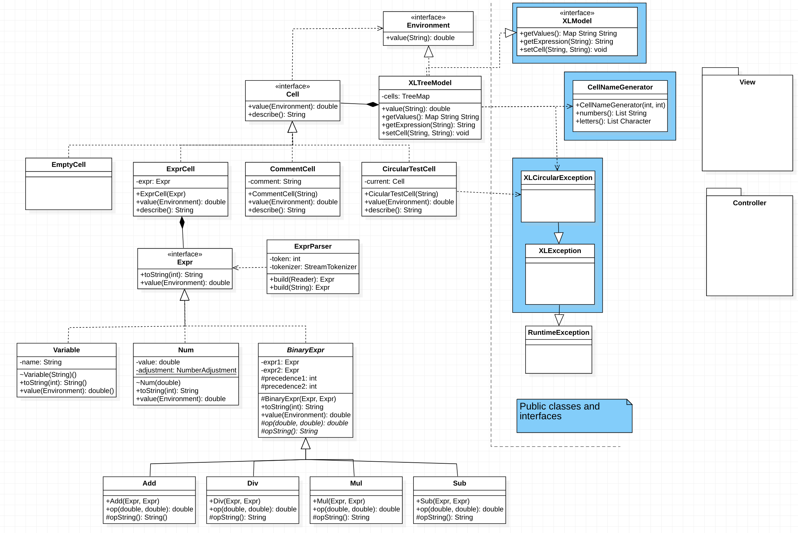
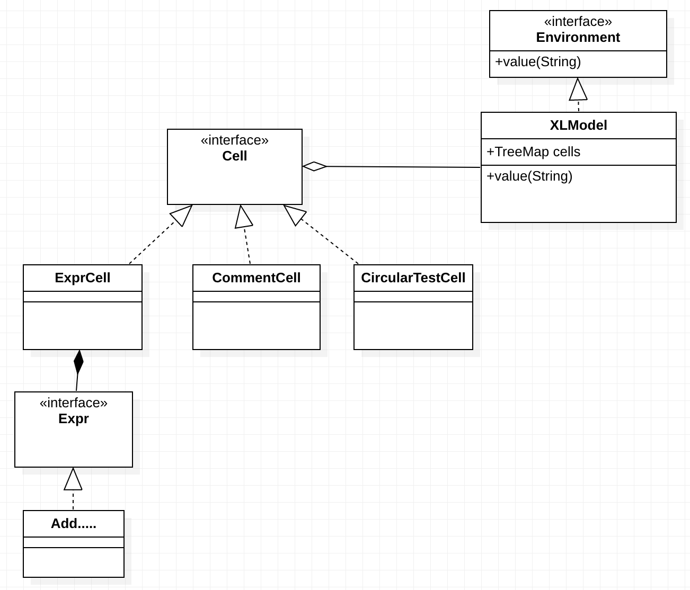

# EDAF60 - group ..: XL

### Group members: 

+ Simon Danielsson
+ Frida Norlund
+ Jakob Henningsson
+ Isabella Ljung

## Running the application

To run the program, simply enter 

~~~{.sh}
./gradlew run
~~~

from the project's root catalogue. 

## Class diagram of model package

## Questions:

+ Do we want to make XLCircularException a checked exception, such that we are ensuring the implementer of the controller to act in case of a circular input expression to the model. In the current state (where XLCircularException extends RuntimeException) we might forcing the implementer of the controller to handle circularities. However, it might be enough to add a "throws" clause in the XLModel interface to make the compiler notice eventual exceptions.    

## Answers to design questions

+ **A3**:

SlotLabel: displays the calculated/evaluated expression 

SlotLabels: stores all slotlabels

Editor: takes input expressions to the model

StatusLabel: display error messages

CurrentLabel: displays the cell name for which the input expresisons will be sent to/displayed in

XL: main class and the frame in which all components are kpt

+ **A4**:

V -> C -> M -> V (Last step depends on if we're using Observer or Flow)

+ **B2**: 

Comments and ExpressionCell (which contains an Expr) should have a common interface (some superinterface to Expr). Call this interface for instance Cell. It should lie in the model package. 

Cell should have methods, value(), toString()

Comments should *not* be parsed by ExprParser.

+ **B4**:

XLModel, which partly functions as a memory. Comment class. 

+ **B5**:

We should store the cells in a Map, particularly a TreeMap. This is because a hashmap needs to wrap a large vector in order for it to have the desired performance (constant timecomplexity get()), which contradicts the demand of low memory usage. We should wrap this TreeMap in some class.

+ **C1**:

Environment is used for fetching a numerical value from a Cell. It should be implemented by the class knowing about all the cells, i.e. the class above which wraps TreeMap (the "memory"). 

+ **D1**:

Only the main model class (which contains the memory) since we only want to display the resulting dataframe. This also decreases coupling (in comparison to making all classes in the model package available fo the GUI). 

+ **D2**:

It should return a string representation of the value in the cell. View should be able to request the model for both the string representation of the value and the string representation of the corresponding expression. 

+ **E2**:

The model should control that all following calcualtions (in conncted cells) are able to be performed. If an input causes e.g. division by zero in some other (connected) cell, a error message should be presented and *the cell with the faulty input should have its state be reversed to the previous state* (before the error was raised). Thus, we should not change any of the contents of the cells where the error was actually *found*. 

+ **E4**:

ExprParser in the Model recognizes the problem and raises an exception (without changing any of its states). This holds for *all* of the different types of problems that may occur (SRP). The *controller* should see/recieves this and should subsequently update the view (in StatusLabel). 

In the model, we will likely have to implement a series of throw-catch sequences in order to get the exception out of the model. This follows because ExprParser is already fully implemented. 

+ **E5**:

Controller, see **E4**. 

+ **F1**:

We should use Flow synchronization because it is easier to work with a concrete controller class which handles the different events. If one uses observers, we will spread this functionality over several classes which is bit more difficult to handle. The main difference is what is triggering the view to look at the model and update itself: some observer interface or the controller. The data in the model **does not** flow through the controller back to the view. The view fetches it by itself from the model, upon notification from the controller. 

+ **F2**:

The **controller** should keep track of which cell is the current cell. 

+ **F3**:

Upon input in the spreadsheet, the view tells the controller to change the model. When the model has changed, the controller *should tell the view to look at the model* and update its view. (Compare this to the view implementing observer and knowing when to look at the model first when model invokes hasChanged() and notifyObservers()).

I.e. the controller triggers the view to change. 

+ **G1**:

We use a trick: add another class implementing Cell (alongside Comment and Expr). Call it something like CircularCell or FirstCell... Store each (first) input to the view in this kind of object (we might also have to temporarily store the previous value in the cell). One should interpret this as a "bomb" in the environment: if another cell/expression invokes 'value()' on this specific object we have reached a circularity and we should throw an exception. Thus, an object of this class should never actually return a value when invoking value(), but should simply throw an exception.

Thus we do all calculations outside of the environemnt (memory), and since we did not change our actual memory (environment) we can 

Thus, upon input of for instance the expression "a2" in the current cell "b1", we first add a 'bomb object' into the environment (with just a reference to the input cell address). We then compute the values of the expression which this expression is pointing to (in our case "a2"), and its eventual cell references, *we throw an exception if we ever reach the bomb (input)* since that means we have obtained circularity. If this is the case, we don't actually put the input into the model map, but instead revert back to the previous expression in the cell. 
If an expressino is not raised, circularity was not obtained, and thus we can insert an expresison object, containing the input expression, into the TreeMap (memory) of the model. 

*This makes the reason for the bomb class having to implement Cell clear. This is because we have to be able to store the bomb in the Environment (in the TreeMap), which is only possible if it is actually implementing Cell.* 

**Note:** after circularity checking (and after successfully inputing the expresison as an Expr in the TreeMap), we also have to update all the values in the other cells (and check for for instance division by zero). 

**Note:** the exception thrown when circualrity is obtained should be caught by the controller, which notifies the model to change its status message. 

**Note on main class**: The main class is XL. In that class we should create a model, a view, and finally a controller which we input the model and view to.

We should use the builder pattern for constructing the controller since it will have a lot of parameters. 

